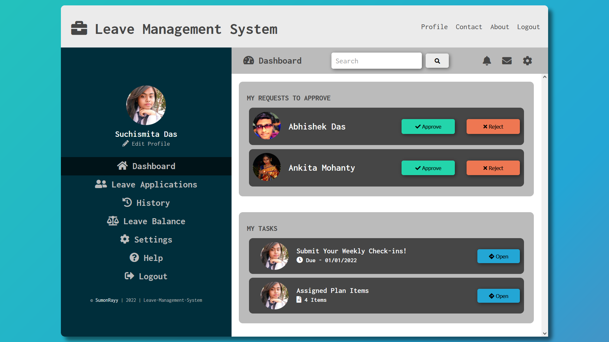

# Leave-Management-System

A simple leave management system for employees.

### Snapshot :

Main Features:
- Manage leaves for employees
- Manage leave requests for employees

Made with :
- [HTML5](https://developer.mozilla.org/en-US/docs/Web/Guide/HTML/HTML5)
- [CSS3](https://developer.mozilla.org/en-US/docs/Web/CSS/CSS3)
- [Font-Awesome](https://fontawesome.com/v4.7.0/icons/)

--------------
## contributing

You can contribute to improve this project by:

- edit the code
- creating a pull request
- submitting new ideas / features suggestions
- reporting a bug
--------------

### Thank You For Checking This Out 🥰🤗 Please give it a Start ⭐ if You've Liked it . . .
## And Follow Me On GitHub 🙏🏻

### [@SumonRayy](https://github.com/SumonRayy)

